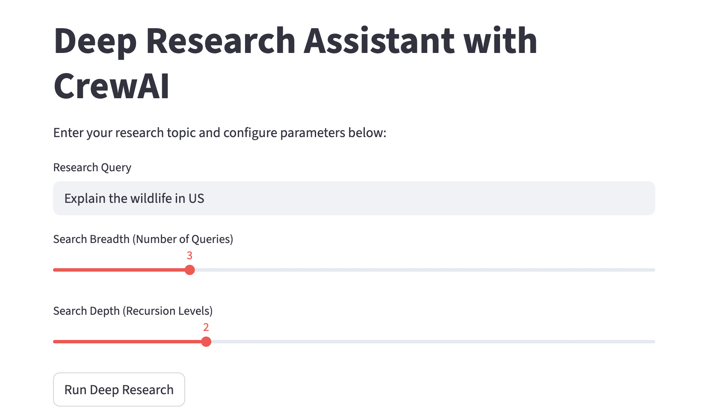

# 🤖 Deep Research AI Agent

An intelligent multi-agent research system powered by **CrewAI** with **Google Gemini** or **local Ollama** (LiteLLM). It performs web research via Firecrawl, analyzes results, and generates professional PDF reports.



## ✨ Features

- **Multi-Agent Architecture**: Three specialized CrewAI agents working together:
  - Research Agent: Conducts deep web searches
  - Summarization Agent: Structures and condenses findings
  - Presentation Agent: Formats professional reports
- **Google Gemini or local Ollama**: Cloud LLM (`LLM_PROVIDER=gemini`) or local (`LLM_PROVIDER=ollama`) for all agents via LiteLLM
- **Web Research via Firecrawl MCP**: Web search through the official Firecrawl MCP server (`firecrawl_search`)
- **Intelligent Fallback**: If web search fails, **KnowledgeFallback** uses Gemini (if configured) or your local Ollama model
- **Configurable Research Parameters**: Adjustable breadth and depth for customized research
- **PDF Report Generation**: Automatic creation of downloadable, formatted PDF reports
- **Real-time Progress**: Watch agents work through the research process in real-time
- **Markdown Cleaning**: Clean, readable output with proper formatting
- **Source Citations**: Automatic extraction and listing of research sources

## 🏗️ Architecture

### Multi-Agent System

```
User Query → Research Agent → Summarization Agent → Presentation Agent → PDF Report
                    ↓
         Firecrawl MCP Server (firecrawl_search)
                    ↓
            Google Gemini / Ollama KnowledgeFallback
```

**Research Agent**
- Role: Web searcher and data collector
- MCP: [Firecrawl MCP](https://www.firecrawl.dev/mcp) (`firecrawl_search`) — **stdio** when `npx` is available; otherwise **FirecrawlSearchDirect** REST (`FIRECRAWL_MCP_TRANSPORT=http` enables hosted MCP)
- Fallback: **KnowledgeFallback** (Gemini if `GOOGLE_API_KEY` set, else Ollama)
- Performs recursive web searches based on breadth and depth parameters
- Agents use CrewAI `max_retry_limit=2` for task execution errors

**Summarization Agent**
- Role: Content summarizer
- Condenses research findings into structured, categorized points
- Maintains accuracy while improving readability

**Presentation Agent**
- Role: Report formatter
- Creates polished, professional research reports
- Ensures consistency and proper structure

### LLM provider

- **Gemini** (default): set `LLM_PROVIDER=gemini` and `GOOGLE_API_KEY`. Model name via `GEMINI_MODEL`.
- **Ollama**: set `LLM_PROVIDER=ollama`, run Ollama locally, set `OLLAMA_MODEL` (default `qwen2.5:3b` for speed; see README for faster tiers).

Used for all agent reasoning and for **KnowledgeFallback** when web search is insufficient (Gemini preferred when the key is present, then Ollama).

## 📋 Prerequisites

- Python 3.13+ (recommended: Python 3.11–3.13 for widest package support)
- pip package manager
- API Keys / runtime:
  - **Firecrawl** (required for web search)
  - **Google API Key** (required when `LLM_PROVIDER=gemini`; optional otherwise for Gemini **KnowledgeFallback**)
  - **Ollama** (required when `LLM_PROVIDER=ollama`)

## 🚀 Installation

1. **Clone the repository**
```bash
git clone <your-repo-url>
cd deep-research-ai-agent
```

2. **Create and activate virtual environment**
```bash
python -m venv .venv
source .venv/bin/activate  # On Windows: .venv\Scripts\activate
```

3. **Install dependencies**
```bash
pip install -r requirements.txt
```

## ⚙️ Configuration

Create a **`.env`** file in the project root.

### Gemini (default)

```env
LLM_PROVIDER=gemini
GOOGLE_API_KEY=your-google-api-key-here
FIRECRAWL_KEY=your-firecrawl-api-key-here
GEMINI_MODEL=gemini-2.5-flash-lite
```

### Ollama (local LLM)

1. Install [Ollama](https://ollama.com/) and pull a model. Suggested tiers by **speed** (fastest → slowest on Mac):

| Speed (typical) | Pull command | Notes |
|-----------------|---------------|--------|
| Fastest | `ollama pull qwen2.5:1.5b` | Lowest latency; weakest multi-step tools |
| **Default in code** | `ollama pull qwen2.5:3b` | Good balance for this app |
| Balanced | `ollama pull llama3.2:3b` | Alternative 3B |
| Slower, smarter | `ollama pull qwen2.5:7b` | Closer to cloud quality, not Flash speed |

2. Set in `.env`:

```env
LLM_PROVIDER=ollama
OLLAMA_MODEL=qwen2.5:3b
OLLAMA_BASE_URL=http://localhost:11434
FIRECRAWL_KEY=your-firecrawl-api-key-here
```

Override `OLLAMA_MODEL` if you pulled a different tag (e.g. `qwen2.5:1.5b` for maximum speed).

Optional: **KnowledgeFallback** still uses Gemini if you add `GOOGLE_API_KEY` (tries Gemini first, then local Ollama).

Keep `pip install -r requirements.txt`; **litellm** is listed for CrewAI routing to Ollama.

Gemini stays the default when `LLM_PROVIDER` is omitted or `gemini`.

### Getting API Keys

**Google AI (Gemini)**
1. Visit [Google AI Studio](https://makersuite.google.com/app/apikey)
2. Sign in with your Google account
3. Click "Create API Key"
4. Copy the key and paste it in your `.env` file

**Firecrawl**
1. Visit [Firecrawl](https://www.firecrawl.dev/)
2. Sign up for an account
3. Navigate to API settings
4. Copy your API key and paste it in your `.env` file

## 🎯 Usage

### Starting the Application

```bash
streamlit run main.py
```

The application will open in your default browser at `http://localhost:8501`

### Conducting Research

1. **Enter Research Query**: Type your research topic in the text input field
2. **Configure Parameters** (defaults: **Breadth 3**, **Depth 2**):
   - **Search Breadth** (1-10): Number of different search queries to perform
   - **Search Depth** (1-5): How deep to recurse into each search
3. **Click "Run Deep Research"**
4. **Monitor Progress**: Watch agents work in real-time
5. **Review Results**: 
   - Read the formatted report in the text area
   - Preview the PDF in the embedded viewer
   - Download the PDF report using the download button

### Research Parameters Explained

- **Breadth = 3, Depth = 2** (Default): Balanced research with moderate coverage
- **Breadth = 10, Depth = 5**: Comprehensive, exhaustive research (slower)
- **Breadth = 1, Depth = 1**: Quick, focused research on a specific topic

## 📦 Project Structure

```
deep-research-ai-agent/
├── main.py                      # Streamlit UI application
├── controllers/
│   └── research_controller.py   # Orchestrates research workflow
├── services/
│   └── agents_service.py        # CrewAI agents, LLM provider, Firecrawl tools
├── models/
│   └── pdf_generator.py         # PDF report generation with ReportLab
├── utils/
│   ├── markdown_cleaner.py      # Markdown cleanup + URL extraction
│   ├── log_sanitizer.py         # Redact secrets in logs
│   ├── mcp_config.py            # Firecrawl MCP transport (stdio / HTTP)
│   └── crewai_safe_console.py   # Redact secrets in CrewAI Rich UI
├── assets/
│   └── ai-agent-research-ui.png # Application screenshot
├── requirements.txt             # Python dependencies
├── .env                         # API keys (not tracked in git)
├── .gitignore                   # Git ignore rules
├── LICENSE                      # MIT License
└── README.md                    # This file
```

## 🛠️ Technology Stack

| Category | Technology |
|----------|-----------|
| **Multi-Agent Framework** | [CrewAI](https://www.crewai.com/) |
| **Web Interface** | [Streamlit](https://streamlit.io/) |
| **Language Model** | [Google Gemini](https://ai.google.dev/) or [Ollama](https://ollama.com/) (`LLM_PROVIDER` in `.env`) |
| **LLM routing** | [LiteLLM](https://docs.litellm.ai/) (CrewAI `gemini/...`, `ollama/...`) |
| **Web Search** | [Firecrawl](https://www.firecrawl.dev/) (MCP + REST) |
| **MCP Protocol** | [Model Context Protocol](https://modelcontextprotocol.io/) |
| **Extras** | [LangChain](https://langchain.com/) (e.g. KnowledgeFallback + Gemini) |
| **PDF Generation** | [ReportLab](https://www.reportlab.com/) |

## 🔍 How It Works

### Step-by-Step Process

1. **Initialization**
   - Load `.env` (`LLM_PROVIDER`, keys, `GEMINI_MODEL`, `OLLAMA_*`)
   - Agents use the configured LLM (Gemini or Ollama via LiteLLM)
   - Create three specialized agents (`max_retry_limit=2`)

2. **Research Phase**
   - Research Agent receives the query
   - Web search via Firecrawl MCP `firecrawl_search` and/or **FirecrawlSearchDirect**
   - If search fails, **KnowledgeFallback** (Gemini when key set, else Ollama HTTP API)
   - Source URLs are collected for the PDF

3. **Summarization Phase**
   - Summarization Agent processes raw research data
   - Structures findings into categorized points
   - Maintains context while condensing information

4. **Presentation Phase**
   - Presentation Agent formats the final report
   - Ensures readability and professional structure
   - Adds proper headings and organization

5. **Output Generation**
   - Markdown cleaning removes formatting artifacts
   - PDF report generated with ReportLab
   - Source links compiled and included
   - Report displayed in UI with download option

## 🧪 Example Use Cases

- **Academic Research**: Gather comprehensive information on scholarly topics
- **Market Research**: Analyze trends, competitors, and market conditions
- **Technical Documentation**: Research technologies and best practices
- **News Analysis**: Compile information on current events from multiple sources
- **Due Diligence**: Research companies, products, or services
- **Literature Reviews**: Gather and summarize published research

## 🐛 Troubleshooting

### Common Issues

**"Google Gen AI native provider not available"**
```bash
pip uninstall crewai
pip install "crewai[google-genai]"
```

**"Google API key is not configured"**
- Ensure `GOOGLE_API_KEY` is set in `.env` file
- Check for typos or extra spaces in the key
- Verify the key is active at [Google AI Studio](https://makersuite.google.com/)

**"Firecrawl API key is not configured" or MCP connection errors**
- Verify `FIRECRAWL_KEY` is correct in `.env`
- Check your Firecrawl API quota/credits at [firecrawl.dev](https://www.firecrawl.dev/)
- Ensure `mcp` is installed: `pip install mcp`
- Firecrawl MCP uses **stdio** when `npx` is installed (API key never in URLs)
- Without Node.js: **FirecrawlSearchDirect** REST tool is used instead (no hosted MCP URL in logs)
- Optional: `FIRECRAWL_MCP_TRANSPORT=http` forces hosted MCP (not recommended — key appears in URLs)
- **KnowledgeFallback** runs when search is insufficient (Gemini and/or Ollama)

**Model name errors (404 NOT_FOUND)** (Gemini)
- Set `GEMINI_MODEL` in `.env` to a [supported model id](https://ai.google.dev/gemini-api/docs/models); default is `gemini-2.5-flash-lite`

**Ollama** — wrong model or not running
- `ollama list` must include the tag in `OLLAMA_MODEL`; ensure the Ollama app is running

**Streamlit connection errors**
```bash
streamlit run main.py --server.port 8502  # Try different port
```

## 📊 Performance Notes

- **Average Research Time**: 1-3 minutes depending on parameters
- **Breadth Impact**: Each additional breadth point adds ~15-30 seconds
- **Depth Impact**: Each additional depth level adds ~10-20 seconds per query
- **API Costs**: Gemini 2.5 Flash Lite is cost-effective (~$0.075 per 1M tokens)

## 📄 License

This project is licensed under the MIT License - see the [LICENSE](LICENSE) file for details.

**Copyright (c) 2025 Naveen Shankar**

## 🙏 Acknowledgments

- [CrewAI](https://www.crewai.com/) for the multi-agent framework
- [Google](https://ai.google.dev/) for Gemini AI
- [Firecrawl](https://www.firecrawl.dev/) for web search capabilities
- [Streamlit](https://streamlit.io/) for the elegant UI framework

**⚠️ Important Notes:**
- **Firecrawl** API key and quota are required for web search
- For **Gemini** mode: Google API key and quota; monitor [Google AI Studio](https://makersuite.google.com/)
- For **Ollama**: no Google quota; runs locally when `LLM_PROVIDER=ollama`
- Research quality depends on Firecrawl and your chosen LLM
- Generated reports should be reviewed for accuracy

**Made with ❤️ using CrewAI — Gemini and/or Ollama**
